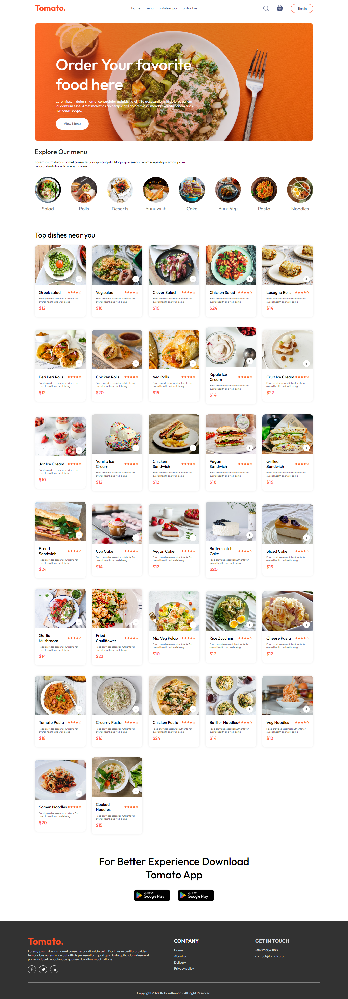
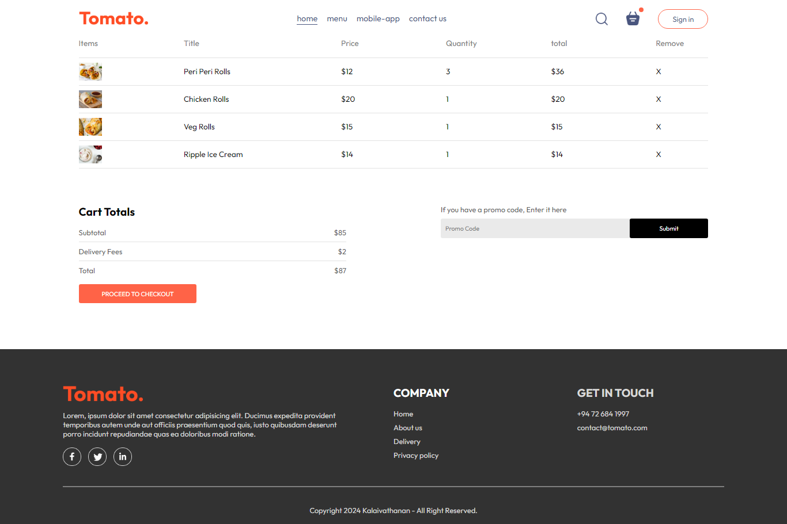
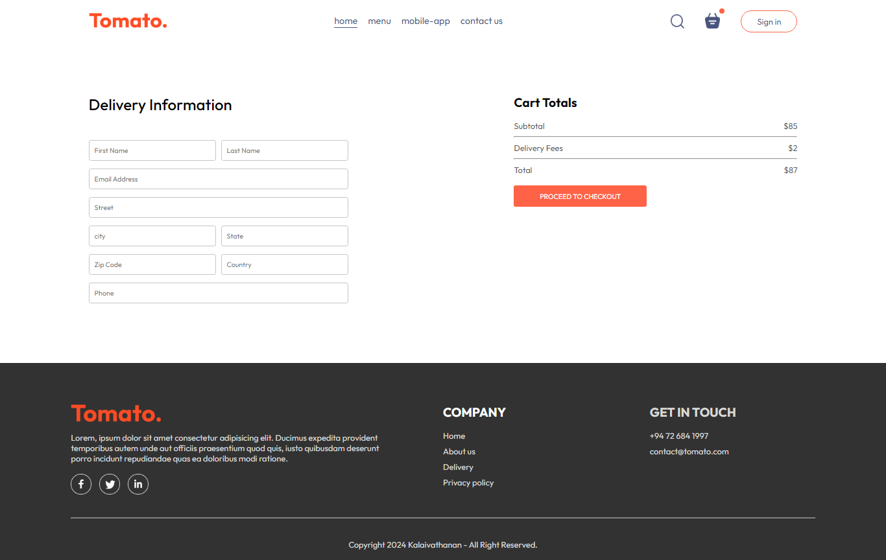

# Food Delivery Application

This is a food delivery application built using React.js. It allows users to browse through a variety of food items, place orders, and track their deliveries.

This template provides a minimal setup to get React working in Vite with HMR and some ESLint rules.

## Screenshots

Here are some screenshots of the application:

## Features

- Browse through a wide range of food items.
- Search for specific food items.
- Add items to cart and place orders.
- Track delivery status.
- User authentication and account management.

## Installation

To run this application locally, follow these steps:

1. Clone this repository to your local machine.
2. Navigate to the project directory.
3. Run `npm install` to install dependencies.
4. Run `npm run dev` to start the development server.
5. Open your browser and navigate to `http://localhost:5173` / or your local host address .

## Technologies Used

- React.js
- JavaScript
- HTML
- CSS

## Contributing

Contributions are welcome! If you find any bugs or have suggestions for improvement, please open an issue or submit a pull request.

## Author

This project was created by [kalaivathanan](https://github.com/kalaivathanan).

## License

This project is licensed under the MIT License. See the [LICENSE](LICENSE) file for details.